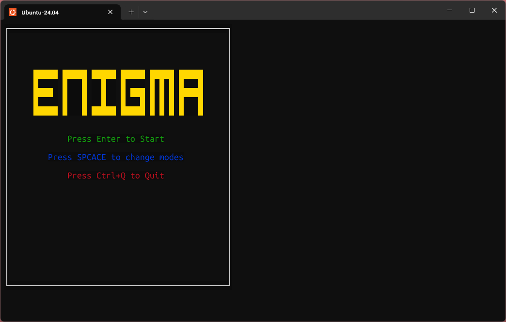
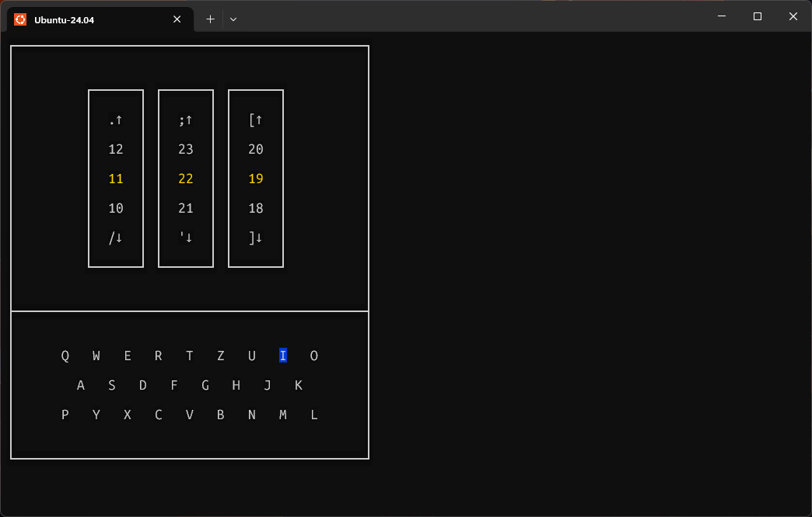
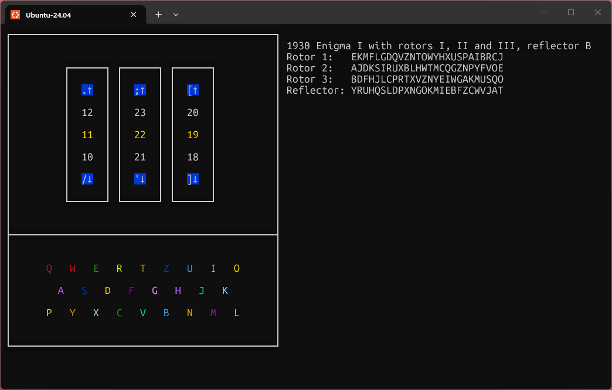

<h1 align="center">The Enigma Machine</h1>

A C/C++ implementation of the historic Enigma machine — the cipher device used by Nazi Germany during World War II. The project relies solely the core mechanics of the original machine, including rotor substitution, stepping, and reflector logic, providing both encryption and decryption functionality. Rotors are fully customizable, allowing users to configure wiring, starting positions, and ring settings to simulate different Enigma variants.

## Screenshots

*Welcome screen*


*Encyrpt screen*


*Set screen*


## Getting Started

### Prerequisites

- C or C++ compiler (e.g., GCC, Clang)

### Build

Clone the repository and compile the source files using your preferred compiler. For example, with GCC:

```bash
make 
```
Or manually:

```bash
git clone https://github.com/[yourusername]/enigma.git
cd enigma
g++ ./src/*.cpp -o .build/enigma
```

Or with Clang:

```bash
clang++ ./src/*.cpp -o ./build/enigma
```

To clean:
```bash
make clean
```

## Usage

Run the script after compiling

```bash
make run
```

Or manually:

```bash 
./build/enigma
```

## Project Structure

- `src/` — Source code
- `build` - For compiled programs
- `external/` - For git submodules

## Contributing

Contributions are welcome! Please open issues or pull requests.

## License

See the `LICENSE` file for details about this project's license. </br>
This project is currently under `GNU GENERAL PUBLIC LICENSE v3.0`